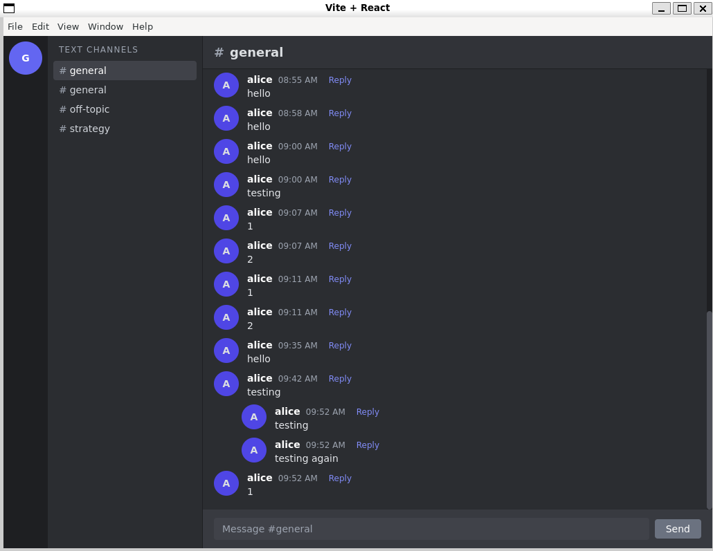

# Discord Clone — Full‑Stack Real‑Time Chat Application  
**Michael Fultz**  
CSE 412 • Spring 2025  

---

## Table of Contents
1. [Project Overview](#project-overview)  
2. [Architecture](#architecture)  
3. [Entity–Relationship Diagram](#entity–relationship-diagram)  
4. [ACID Compliance & Concurrency Control](#acid-compliance--concurrency-control)  
5. [Advanced SQL: Recursive CTE](#advanced-sql-recursive-cte)  
6. [Demonstration Queries](#demonstration-queries)  
7. [Screenshots](#screenshots)  

---

## Project Overview
A desktop **Discord‑style** chat platform built entirely from scratch. Users can join servers, switch channels, and exchange messages in real time.  

* **Tech stack:** Node.js + Express (REST API), React 18 + Electron (desktop UI), PostgreSQL 14 (RDBMS), Socket.IO (WebSocket transport), Tailwind CSS (styling).  
* **Key features:** full CRUD, threaded replies, optimistic UI, ACID‑compliant schema, Recursive CTE for fetching complete threads, desktop installer via electron‑builder.

---

## Architecture
| Layer | Technology | Highlights |
|-------|------------|------------|
| **Frontend** | React 18 + Tailwind (in Electron) | Dark theme, server rail, channel list, message pane, reply banner |
| **Realtime** | Socket.IO | One room per channel, `message:new` broadcast to all clients |
| **Backend** | Node.js / Express | Controllers for CRUD, REST + JSON, global error handling |
| **Database** | PostgreSQL 14 | Normalised schema, PK/FK constraints, recursive CTE for threads |

---

## Entity–Relationship Diagram


**Table highlights**  
* `messages.parent_message_id` ⟶ self‑FK that enables reply threads.  
* `server_membership` composite PK (`user_id`, `server_id`) enforces one‑membership‑per‑user‑per‑server.  
* All FK columns `ON DELETE CASCADE` to maintain referential integrity.

---

## ACID Compliance & Concurrency Control
* **Atomicity (A)** — Each endpoint performs a single SQL statement or an explicit transaction; failures roll back completely.  
* **Consistency (C)** — PK/FK, `NOT NULL`, and unique indexes ensure only valid states persist.  
* **Isolation (I)** — Default *READ COMMITTED* level prevents dirty reads; WebSocket events are sent **after** commit to guarantee clients receive only durable data.  
* **Durability (D)** — PostgreSQL WAL + `fsync` protect committed changes against crashes.  

**Concurrency note:** UI is optimistic (adds message immediately), duplicates prevented by `message_id` uniqueness on subsequent `message:new` events.

---

## Advanced SQL: Recursive CTE
> Endpoint: `GET /messages/:id/thread`

```sql
WITH RECURSIVE thread AS (
    SELECT m.*, u.username
      FROM messages m
      JOIN users u ON u.user_id = m.author_id
     WHERE m.message_id = $1              
  UNION ALL
    SELECT c.*, u2.username
      FROM messages c
      JOIN thread t ON c.parent_message_id = t.message_id
      JOIN users  u2 ON u2.user_id = c.author_id
)
SELECT * FROM thread ORDER BY timestamp;
```
Fetches root + all descendants in a single call → zero N+1 queries.

---

## Demonstration Queries
File **`database/queries.sql`** contains eight test cases:

| # | Purpose | Lines |
|---|---------|-------|
| 1 | Create new user | 1–4 |
| 2 | Create server + auto‑membership | 7–16 |
| 3 | List servers for user 1 | 22–27 |
| 4 | List messages with author names | 30–38 |
| 5 | Update channel name | 41–44 |
| 6 | Delete messages older than 30 days | 47–50 |
| 7 | Recursive thread query | 55–69 |
| 8 | Aggregate messages per channel | 74–82 |

---

## Screenshots
  
*Figure 1 – Desktop Electron client showing real‑time chat and thread reply.*

---

### Reproducibility Notes
1. `psql < database/schema.sql && psql < database/sample_data.sql`  
2. `cd backend && npm install && npm start`  
3. `cd desktop_app && npm install && npm run dev`  
4. Login as *alice* → see live chat across two windows.

---

© 2025 Michael Fultz

